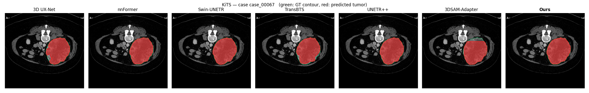
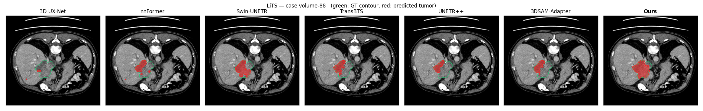
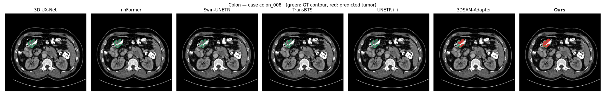
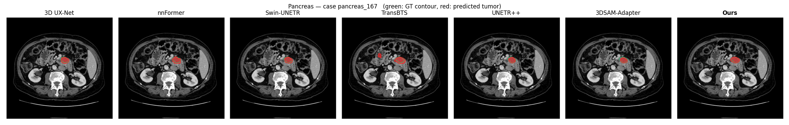

# SAM+D

**Official PyTorch implementation of**

> **SAM+D: Parameter-Efficient Dimensional Lifting of SAM-Family Models via Depth-Routed LoRA and Depth Shifting**
> Yu Song, Hao Sun, Shiyu Teng, Ikuko Nishikawa, Yen-Wei Chen
> *European Conference on Computer Vision (ECCV) 2026*
> [ [arXiv](https://arxiv.org/abs/2607.29033) ]

---

## Abstract

The Segment Anything Model family (SAM, SAM2) provides powerful 2D / 2D+T segmentation foundation models, but extending them to volumetric domains such as 3D medical imaging remains expensive and ad-hoc — typically demanding full fine-tuning or heavy 3D-specific adapters. We propose **SAM+D**, a unified parameter-efficient framework that lifts SAM-family backbones to 3D by injecting two lightweight modules into the frozen 2D image encoder:

- **DRLoRA** (Depth-Routed Mixture of LoRA Experts) — a per-slice mixture of low-rank adapters whose gates are conditioned on the slice position *z* alone. DRLoRA supplies an anatomical depth prior that the frozen backbone cannot recover, is inherently load-balanced (no auxiliary loss needed), and uses a router roughly twenty times smaller than content-routed mixtures of LoRA experts.
- **DSM** (Depth Shift Module) — a parameter-free, zero-MAC channel-shift primitive along the depth axis that propagates inter-slice information at a cost of roughly 1.7 % of a single ViT-B block's forward latency on an NVIDIA RTX 5090.

On four public 3D medical segmentation benchmarks (KiTS, LiTS, Pancreas, Colon), SAM+D matches or exceeds 3D-conv adapter baselines and recent mixture-of-LoRA approaches (MoLoRA, MoLE, MixLoRA), with **fewer than 3 % of the backbone parameters trained**.

---

## Main Results

Reported metrics are **Dice** on the held-out test split, point-prompted multi-crop inference (`test_point.py`, `--num_crops 5 --num_points 1`), best over runs.

| Dataset | Best decoder | Trained modules | **Test Dice** |
|---|---|---|---|
| **KiTS** | SAM decoder + LoRA | Encoder DRLoRA + DSM + Decoder LoRA | **0.8474** |
| **LiTS** | SAM decoder + LoRA | Encoder DRLoRA + DSM + Decoder LoRA | **0.6333** |
| **Colon** | Conv3D decoder | Encoder DRLoRA + DSM + Conv3D head | **0.6639** |
| **Pancreas** | SAM decoder + LoRA | Encoder DRLoRA + DSM + Decoder LoRA | **0.5968** |

Please refer to the paper for full comparisons, ablations, and NSD numbers.

### Qualitative Results

Same test case per dataset, seven methods side by side. Gray: CT slice · **green**: ground-truth tumor contour · **red**: predicted tumor mask. Ours is on the right of every row.

**KiTS** — case `case_00067`


**LiTS** — case `volume-88`


**Colon** — case `colon_008`


**Pancreas** — case `pancreas_167`


Per-case per-method PNGs for the following seven methods — **3D UX-Net, nnFormer, Swin-UNETR, TransBTS, UNETR++, 3DSAM-Adapter, Ours** — are available in the [Google Drive Visualizations folder](https://drive.google.com/drive/folders/1SFk4lwFewtzShYcP_qSPJvLqKK9EG6DR?usp=sharing) under `Visualizations/<Method>/<Dataset>/<case>.png` (168 test cases × 7 methods × 4 datasets ≈ 1,176 images).

---

## SAM2+D

The paper also introduces **SAM2+D**, which is *the same method* — DRLoRA + DSM — applied to the SAM2 backbone for 3D+T volumetric video segmentation. The routing, shift, and adapter primitives are unchanged; only the underlying frozen 2D+T encoder differs. **The SAM2+D training / inference code is not released in this repository**; this repo covers only SAM+D on SAM ViT-B. Please refer to the paper for the SAM2+D architecture and results.

---

## Pretrained Checkpoints

The four best-per-dataset checkpoints reported above are released on Google Drive:

**[Download all 4 checkpoints (Google Drive folder)](https://drive.google.com/drive/folders/1SFk4lwFewtzShYcP_qSPJvLqKK9EG6DR?usp=sharing)**

| Dataset  | Decoder    | File in the folder      |
|---|---|---|
| KiTS     | SAM + LoRA | `kits_best.pth.tar`     |
| LiTS     | SAM + LoRA | `lits_best.pth.tar`     |
| Colon    | Conv3D     | `colon_best.pth.tar`    |
| Pancreas | SAM + LoRA | `pancreas_best.pth.tar` |

Pass any of the downloaded files directly via `--checkpoint <path>`:

```bash
python test_point.py --data kits --decoder_type sam \
  --checkpoint /path/to/kits_best.pth.tar   ...
```

(No rename or particular directory placement is required. `--checkpoint` also accepts the shortcut strings `last` / `best`, in which case it loads `<snapshot_path>/<name>.pth.tar` — useful when resuming training runs of your own.)

---

## Repository Layout

```
SAM-Plus-D/
├── modeling/                 # SAM+D model + DRLoRA + DSM
│   ├── lora.py               # LoRA expert + DRLoRA router (5 routing modes)
│   ├── dsm.py                # DSM (depth shift) primitive
│   ├── drlora_block.py       # ViT block wrapper injecting DRLoRA + DSM
│   ├── sam_d.py              # end-to-end SAM+D model
│   ├── decoder.py            # Conv3D / MLA decoder heads
│   ├── image_encoder.py      # SAM ViT-B encoder helpers
│   ├── mask_decoder.py       # SAM mask decoder helpers (LoRA-injectable)
│   └── prompt_encoder.py     # SAM prompt encoder helpers
├── dataset/                  # KiTS / LiTS / Pancreas / Colon loaders
├── utils/                    # logging + checkpoint helpers
├── train.py                  # single-stage training (any decoder, any routing mode)
├── train_auto.py             # auto-prompted training variant
├── test.py                   # sliding-window evaluation
├── test_point.py             # point-prompted multi-crop evaluation (main protocol)
├── test_auto.py              # auto-prompted evaluation
├── postprocess.py            # keep-largest-component post-processing
└── eval_postprocessed.py     # metric computation on post-processed predictions
```

---

## Installation

Tested on Ubuntu 24.04, Python 3.10, PyTorch 2.10 + CUDA 12.8, NVIDIA RTX 5090.

```bash
git clone https://github.com/JerrySongCST/SAM-Plus-D.git
cd SAM-Plus-D
conda create -n samd python=3.10 -y
conda activate samd
pip install -r requirements.txt
```

Download the SAM ViT-B checkpoint used as the frozen backbone:

```bash
mkdir -p ../ckpt
wget https://dl.fbaipublicfiles.com/segment_anything/sam_vit_b_01ec64.pth -O ../ckpt/sam_vit_b_01ec64.pth
```

---

## Data Preparation

The four public datasets (KiTS / LiTS / Pancreas / Colon) are **preprocessed following [3DSAM-Adapter (Gong et al.)](https://github.com/med-air/3DSAM-adapter)** — please refer to their repository for the raw-data download instructions, resampling / cropping pipeline, and the exact `split.pkl` files used for cross-validation. Our data-loading conventions and per-dataset normalization statistics are inherited from theirs.

Expected on-disk layout:
- **KiTS**: `<data_prefix>/kist_update/data/{volume-xxx.nii, segmentation-xxx.nii}` + `split.pkl`
- **LiTS**: `<data_prefix>/Task01_LITS17/Training/volume-<id>/{image.nii.gz, segmentation.nii.gz}` + `split.pkl`
- **Pancreas / Colon**: MSD Task07 / Task10 layout + `split.pkl`

Each `split.pkl` is a Python-pickled list of 5 folds, each a dict with keys `train / val / test`, mapping case IDs to `[<volume-path>, <segmentation-path>]`. See `dataset/datasets.py` for the exact loading convention and per-dataset normalization statistics.

---

## Training

Example (KiTS, SAM decoder with DRLoRA + DSM + decoder LoRA, single GPU):

```bash
python train.py \
  --data kits \
  --data_prefix /path/to/kits/kist_update/data \
  --sam_checkpoint ../ckpt/sam_vit_b_01ec64.pth \
  --snapshot_path snapshots \
  --decoder_type sam --num_points 1 \
  --rank 16 --num_experts 4 --shift_ratio 0.25 \
  --routing_mode depth \
  --batch_size 3 --lr 4e-4 --max_epoch 500 --eval_interval 4
```

The `--routing_mode` flag switches between the ablated routing mechanisms:

| `--routing_mode` | Method |
|---|---|
| `depth` *(default, ours)* | DRLoRA — position-only routing |
| `content` | MoLoRA baseline (content, dense softmax) |
| `content_top2` | MoLE (content, top-2 + importance loss) |
| `content_top1` | MixLoRA (content, top-1 + load-balance loss) |
| `single` | plain LoRA (`--num_experts 1`) |

Multi-GPU is supported via `torchrun --nproc_per_node=N train.py ...`.

---

## Evaluation

The main test protocol is **point-prompted multi-crop inference**: five random-jitter crops around the ground-truth tumor centroid, softmax-averaged, argmax, then largest-component post-processing.

```bash
python test_point.py \
  --data kits \
  --data_prefix /path/to/kits/kist_update/data \
  --sam_checkpoint ../ckpt/sam_vit_b_01ec64.pth \
  --decoder_type sam --num_points 1 \
  --num_crops 5 --jitter 15 --min_size 100 \
  --routing_mode depth \
  --checkpoint /path/to/kits_best.pth.tar
```

For sliding-window baselines, use `test.py` with the same arguments.

---

## Citation

If you find this work useful, please cite the arXiv version:

```bibtex
@misc{song2026samplusd,
  title         = {SAM+D: Parameter-Efficient Dimensional Lifting of SAM-Family Models
                   via Depth-Routed LoRA and Depth Shifting},
  author        = {Song, Yu and Sun, Hao and Teng, Shiyu and Nishikawa, Ikuko and Chen, Yen-Wei},
  year          = {2026},
  eprint        = {2607.29033},
  archivePrefix = {arXiv},
  primaryClass  = {cs.CV},
  url           = {https://arxiv.org/abs/2607.29033}
}
```

---

## Acknowledgements

Our implementation builds on the official Segment Anything (SAM) release from Meta AI. The four public datasets (KiTS / LiTS / Pancreas / Colon) are preprocessed following the pipeline released by **[3DSAM-Adapter (Gong et al., MedIA 2024)](https://github.com/med-air/3DSAM-adapter)** — we thank the authors for open-sourcing their preprocessing scripts and cross-validation splits. We also thank the KiTS, LiTS, and Medical Segmentation Decathlon organizers for making their datasets publicly available.

---

## Contact

For questions, collaboration, or early-access requests, please open an issue on this repository.
